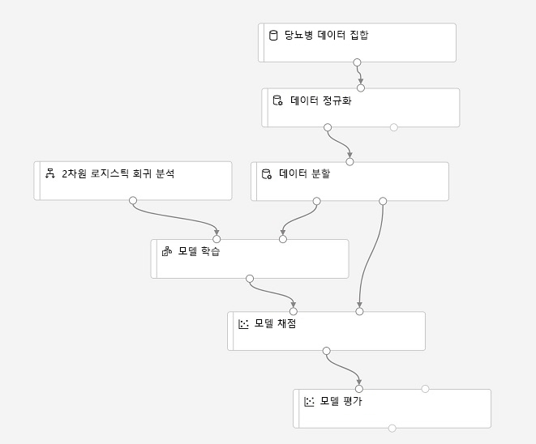
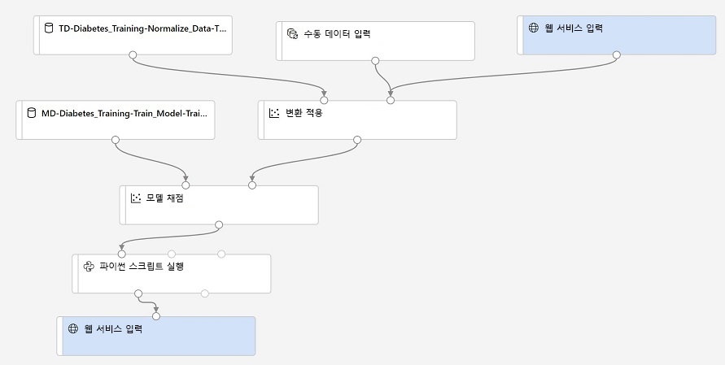

---
lab:
    title: 'Azure Machine Learning Designer 사용'
---
# Azure Machine Learning Designer 사용

Azure Machine Learning *Designer*에서 제공되는 끌어서 놓기 환경을 통해 워크플로, 즉 기계 학습 모델을 만들기 위한 데이터 수집, 변환, 모델 학습 모듈의 *파이프라인*을 정의할 수 있습니다. 그런 다음 클라이언트 애플리케이션이 *유추*(새 데이터에서 예측 생성)에 사용할 수 있는 웹 서비스로 이 파이프라인을 게시할 수 있습니다.

## 시작하기 전 주의 사항

*[Azure Machine Learning 작업 영역 만들기](01-create-a-workspace.md)* 연습을 아직 완료하지 않았으면 해당 연습을 완료하여 Azure Machine Learning 작업 영역과 컴퓨팅 인스턴스를 만들고 이 연습에 필요한 Notebook을 복제합니다.

## 컴퓨팅 리소스 구성

Azure Machine Learning Designer를 사용하려면 모델 학습 실험을 실행할 컴퓨팅 리소스가 필요합니다.

1. Azure 구독과 연결된 Microsoft 자격 증명을 사용하여 [Azure Machine Learning Studio](https://ml.azure.com?azure-portal=true)에 로그인한 다음 Azure Machine Learning 작업 영역을 선택합니다.
2. Azure Machine Learning Studio에서 **컴퓨팅** 페이지를 표시하고 **컴퓨팅 인스턴스** 탭에서 컴퓨팅 인스턴스가 아직 실행되고 있지 않으면 인스턴스를 시작합니다. 이 컴퓨팅 인스턴스를 사용하여 학습시킨 모델을 테스트합니다.
3. 컴퓨팅 인스턴스가 시작되는 동안 **컴퓨팅 클러스터** 탭으로 전환합니다. 기존 컴퓨팅 클러스터가 아직 없으면 다음 설정을 사용하여 새 컴퓨팅 클러스터를 추가합니다. 이 클러스터를 사용하여 학습 파이프라인을 실행합니다.
    - **지역**: *작업 영역과 같은 지역*
    - **가상 머신 우선 순위**: 전용
    - **가상 머신 유형**: CPU
    - **가상 머신 크기**: Standard_DS11_v2
    - **컴퓨팅 이름**: *고유한 이름 입력*
    - **최소 노드 수**: 0
    - **최대 노드 수**: 2
    - **스케일 다운 전 유휴 시간(초)**: 120
    - **SSH 액세스 사용**: 선택 안 함

## 학습 데이터 세트 검토

이제 학습 파이프라인을 실행하는 데 사용할 수 있는 컴퓨팅 리소스를 만들었으므로 모델을 학습시키는 데 사용할 데이터가 필요합니다.

1. Azure Machine Learning Studio에서 **데이터 세트** 페이지를 확인합니다. 데이터 세트는 Azure ML에서 사용하려는 특정 데이터 파일 또는 테이블을 나타냅니다.
2. **diabetes dataset** 데이터 세트를 이전에 만들었으면 해당 데이터 세트를 엽니다. 이 데이터 세트를 만들지 않았으면 다음 설정을 사용하여 웹 파일에서 새 데이터 세트를 만든 후 엽니다.
    * **기본 정보**:
        * **웹 URL**: https://aka.ms/diabetes-data
        * **이름**: diabetes dataset
        * **데이터 세트 형식**: 테이블 형식
        * **설명**: 당뇨병 데이터
    * **설정 및 미리 보기**:
        * **파일 형식**: 구분 기호로 분리됨
        * **구분 기호**: 쉼표
        * **인코딩**: UTF-8
        * **열 헤더**: 첫 번째 파일의 헤더 사용
        * **행 건너뛰기**: 없음
    * **스키마**:
        * **경로** 이외의 모든 열 포함
        * 자동으로 검색된 유형 검토
    * **세부 정보 확인**:
        * 만든 후 데이터 세트 프로필 생성 안 함

4. **탐색** 페이지를 표시하여 데이터 샘플을 확인합니다. 이 데이터는 당뇨병 검사를 받은 환자의 세부 정보를 나타냅니다. 임상 검사의 측정값을 토대로 환자가 당뇨병 확진 판정을 받을 가능성을 예측하는 모델을 학습시키는 데 이 데이터를 사용하게 됩니다.

## Designer 파이프라인 만들기

Designer 사용을 시작하려면 먼저 파이프라인을 만들고 사용할 데이터 세트를 추가해야 합니다.

1. Azure Machine Learning Studio에서 **Designer** 페이지를 표시하여 새 파이프라인을 만듭니다.
2. 기본 파이프라인 이름(**Pipeline-Created-on-*date***)을 **Visual Diabetes Training**으로 변경합니다. 기본 이름을 클릭하거나 파이프라인 이름 옆의 **&#9881;** 아이콘을 클릭하여 변경할 수 있습니다.
3. 파이프라인을 실행할 컴퓨팅 대상을 지정해야 합니다. **설정** 창에서 **컴퓨팅 대상 선택**을 클릭하고, 컴퓨팅 클러스터를 선택합니다.
4. Designer의 왼쪽에서 **데이터 세트** 섹션을 확장한 다음 **diabetes dataset** 데이터 세트를 캔버스로 끕니다.
5. 캔버스에서 **당뇨병 데이터 세트** 모듈을 선택합니다. 그런 다음 마우스 오른쪽 단추로 클릭하고 **시각화** 메뉴에서 **데이터 세트 출력**을 선택합니다.
6. 데이터 스키마를 검토합니다. 여러 열의 분포가 히스토그램으로 표시됩니다. 그런 다음 시각화를 닫습니다.

## 변환 추가

모델 학습을 진행하려면 대개 데이터에 전처리 변환을 다소 적용해야 합니다.

1. 왼쪽 창에서 **데이터 변환** 섹션을 확장합니다. 이 섹션에는 모델 학습 전에 데이터를 변환하는 데 사용할 수 있는 광범위한 모듈이 포함되어 있습니다.
2. **데이터 일반화** 모듈을 캔버스의 **diabetes dataset** 모듈 아래로 끕니다. 그런 다음 **diabetes dataset** 모듈의 출력을 **데이터 일반화** 모듈의 입력에 연결합니다.
3. **데이터 일반화** 모듈을 선택하여 해당 설정을 확인합니다. 설정에서 변환 방법과 변환할 열을 지정해야 합니다. 그런 다음 변환을 **ZScore**로 유지하고 열을 편집하여 다음 열 이름을 포함합니다.
    * PlasmaGlucose
    * DiastolicBloodPressure
    * TricepsThickness
    * SerumInsulin
    * BMI
    * DiabetesPedigree

    **참고**: 숫자 열을 일반화하여 배율을 동일하게 설정하고, 모델 학습을 차지하는 큰 값을 가진 열을 피하고 있습니다. 일반적으로는 이러한 전처리 변환을 다수 적용하여 학습용 데이터를 준비합니다. 하지만 이 연습에서는 간단한 변환 과정만 수행합니다.

4. 이제 데이터를 학습과 유효성 검사를 위한 개별 데이터 세트로 분할할 수 있습니다. 왼쪽 창의 **데이터 변환** 섹션에서 **데이터 분할** 모듈을 캔버스의 **데이터 일반화** 모듈 아래로 끕니다. 그런 다음 **데이터 일반화** 모듈의 *변환된 데이터 세트*(왼쪽) 출력을 **데이터 분할** 모듈의 입력에 연결합니다.
5. **데이터 분할** 모듈을 선택하고 해당 설정을 다음과 같이 구성합니다.
    * **분할 모드**: 행 분할
    * **첫 번째 출력 데이터 세트의 행 비율**: 0.7
    * **임의 초기값**: 123
    * **계층화된 분할**: False

## 모델 학습 모듈 추가

데이터를 준비하고 학습 및 유효성 검사 데이터 세트로 분할하고 나면 모델 학습 및 평가를 위해 파이프라인을 구성할 수 있습니다.

1. 왼쪽 창에서 **모델 학습** 섹션을 확장하고 **모델 학습** 모듈을 캔버스의 **데이터 분할** 모듈 아래로 끕니다. 그런 다음 **데이터 분할** 모듈의 *결과 데이터 세트1*(왼쪽) 출력을 **모델 학습** 모듈의 *데이터 세트*(오른쪽) 입력에 연결합니다.
2. 여기서는 **Diabetic** 값을 예측하는 모델의 학습을 진행할 것이므로, **모델 학습** 모듈을 선택한 다음 해당 설정을 수정하여 **레이블 열**을 **Diabetic**으로 설정합니다. 열 이름의 대/소문자와 철자를 정확하게 입력해야 합니다.
3. 이 모델이 예측할 **Diabetic** 레이블은 이진 열(당뇨 환자의 경우 1, 기타 환자의 경우 0)이므로 *분류* 알고리즘을 사용하여 모델을 학습시켜야 합니다. **기계 학습 알고리즘** 섹션을 확장하고 **분류**에서 **2클래스 로지스틱 회귀** 모듈을 캔버스의 **데이터 분할** 모듈 왼쪽/**모델 학습** 모듈 위로 끕니다. 그런 다음 이 모듈의 출력을 **모델 학습** 모듈의 **미학습 모델**(왼쪽) 입력에 연결합니다.
4. 학습된 모델을 테스트하려면 이 모델을 사용하여 원래 데이터를 분할할 때 별도로 저장해 둔 유효성 검사 데이터 세트의 점수를 매겨야 합니다. **모델 채점 및 평가** 섹션을 확장하고 **모델 채점** 모듈을 캔버스의 **모델 학습** 모듈 아래로 끕니다. 그런 다음 **모델 학습** 모듈의 출력을 **모델 채점** 모듈의 **학습된 모델**(왼쪽) 입력에 연결합니다. 그리고 나서 **데이터 분할** 모듈의 **결과 데이터 세트2**(오른쪽) 출력을 **모델 채점** 모듈의 **데이터 세트**(오른쪽) 입력으로 끕니다.
5. 모델의 성능을 평가하려면 유효성 검사 데이터 세트의 점수를 매겨서 생성된 몇 가지 메트릭을 확인해야 합니다. **모델 채점 및 평가** 섹션에서 **모델 평가** 모듈을 캔버스의 **모델 채점** 모듈 아래로 끕니다. 그런 다음 **모델 채점** 모듈의 출력을 **모델 평가** 모듈의 **데이터 세트 채점**(왼쪽) 입력에 연결합니다.

## 학습 파이프라인 실행

데이터 흐름 단계를 정의하고 나면 학습 파이프라인을 실행하여 모델을 학습시킬 수 있습니다.

1. 파이프라인이 다음과 같이 표시되는지 확인합니다.

    

2. 우측 상단에서 **제출**을 클릭합니다. 그런 다음 메시지가 표시되면 **mslearn-designer-train-diabetes** 실험을 새로 만들어 실행합니다.  그러면 컴퓨팅 클러스터가 초기화되고 파이프라인이 실행되는데, 이 과정은 10분 이상 걸릴 수 있습니다. 파이프라인 실행 상태는 디자인 캔버스 오른쪽 위에서 확인할 수 있습니다.

    > **팁**: **GraphDatasetNotFound** 오류가 발생할 경우 데이터 세트를 선택하고 해당 속성 창에서 **버전**("항상 최신 버전 사용"과 1 간을 전환할 수 있음)을 변경한 다음 파이프라인을 다시 실행하세요.
    >
    > 실행 중인 파이프라인과 만들어진 실험은 **파이프파인** 및 **실험** 페이지에서 확인할 수 있습니다. 실험이 완료되면 **Designer** 페이지의 **시각적 당뇨병 학습** 파이프라인으로 다시 전환합니다.

3. **데이터 일반화** 모듈이 완료되면 이를 선택합니다. **전환된 데이터 세트**섹션의 **데이터 출력** 내 **출력 + 로그** 탭의 **설정** 창에서 **시각화** 아이콘을 클릭하면 변환된 열의 통계 및 분포 시각화를 확인할 수 있습니다.
4. **데이터 일반화** 시각화를 닫고 나머지 모듈이 완료될 때까지 기다립니다. 그러고 나서 **모델 평가** 모듈의 출력을 시각화하여 모델의 성능 메트릭을 확인합니다.

    **참고**: 이 모델의 성능은 별로 좋지 않습니다. 그 이유 중 하나는 최소한의 기능 엔지니어링과 전처리만 수행했기 때문입니다. 서로 다른 몇 가지 분류 알고리즘을 실행하여 결과를 비교해 볼 수 있습니다. 즉, **데이터 분할** 모듈의 출력을 여러 **모델 학습** 및 **모델 점수 매기기** 모듈에 연결하고 점수를 매긴 두 번째 모델을 **모델 평가** 모듈에 연결한 다음 결과를 나란히 표시하여 비교할 수 있습니다. 이 연습의 목표는 완벽한 모델을 학습시키는 방법이 아니라 Designer 인터페이스의 사용법을 파악하는 것이라는 점을 기억하세요!

## 유추 파이프라인 만들기

앞에서 *학습 파이프라인*을 사용하여 모델을 학습시켰습니다. 이제 학습된 모델을 사용하여 새 데이터의 레이블을 예측하는 *유추 파이프라인*을 만들 수 있습니다.

1. **유추 파이프라인 만들기** 드롭다운 목록에서 **실시간 유추 파이프라인**을 클릭합니다. 몇 초가 지나면 파이프라인의 새 버전인 **시각적 당뇨병 학습 - 실시간 유추**가 열립니다.
2. 새 파이프라인의 이름을 **당뇨병 예측**으로 변경하고 새 파이프라인을 검토합니다. 이 파이프라인의 정규화 변환 및 학습된 모델은 캡슐화되어 있습니다. 따라서 학습 데이터의 통계를 사용하여 새 데이터 값을 일반화하며, 학습된 모델을 사용하여 새 데이터의 점수를 매깁니다.
3. 유추 파이프라인은 새 데이터가 원래 학습 데이터의 스키마와 일치한다고 가정하므로, 학습 파이프라인의 **diabetes dataset** 데이터 세트가 포함됩니다. 이 입력 데이터에는 모델이 예측하는 **Diabetic** 레이블이 포함되어 있는데, 이 레이블은 당뇨병을 아직 예측하지 않은 신규 환자 데이터에 포함하기에 적합하지 않습니다.
4. 유추 파이프라인의 **diabetes dataset** 데이터 세트는 삭제하고 **데이터 입력 및 출력** 섹션의 **수동으로 데이터 입력** 모듈로 바꿉니다. 그러면 **웹 서비스 입력**과 같은 **변환 적용** 모듈의 동일한 **dataset** 입력에 연결됩니다. 그런 후에 다음 CSV 입력을 사용하도록 **수동으로 데이터 입력** 모듈의 설정을 수정합니다. 이 입력에는 세 가지 신규 환자 관찰 정보의 레이블이 없는 기능 값이 포함되어 있습니다.

```CSV
PatientID,Pregnancies,PlasmaGlucose,DiastolicBloodPressure,TricepsThickness,SerumInsulin,BMI,DiabetesPedigree,Age
1882185,9,104,51,7,24,27.36983156,1.350472047,43
1662484,6,73,61,35,24,18.74367404,1.074147566,75
1228510,4,115,50,29,243,34.69215364,0.741159926,59
```

5. 유추 파이프라인에 포함되어 있는 **모델 평가** 모듈은 새 데이터를 예측할 때는 유용하지 않으므로 삭제합니다.
6. **모델 점수 매기기** 모듈의 출력에는 모든 입력 기능과 예측된 레이블 및 확률 점수가 포함됩니다. 예측 및 확률만 출력에 포함되도록 제한하려면, **모델 점수 매기기** 모듈과 **웹 서비스 출력** 간의 연결을 삭제하고, **Python 언어** 섹션의 **Python 스크립트 실행** 모듈을 추가합니다. 그런 다음 **모델 점수 매기기** 모듈의 출력을 **Python 스크립트 실행**의 **Dataset1**(맨 왼쪽) 입력에 연결하고, **Python 스크립트 실행** 모듈의 출력을 **웹 서비스 출력**에 연결합니다. 그러고 나서 다음 코드를 사용하도록 **Python 스크립트 실행** 모듈의 설정을 수정합니다. 기존 코드를 모두 바꿔야 합니다.

```Python
import pandas as pd

def azureml_main(dataframe1 = None, dataframe2 = None):

    scored_results = dataframe1[['PatientID', 'Scored Labels', 'Scored Probabilities']]
    scored_results.rename(columns={'Scored Labels':'DiabetesPrediction',
                                    'Scored Probabilities':'Probability'},
                            inplace=True)
    return scored_results
```

7. 파이프라인이 다음과 같이 표시되는지 확인합니다.

    

9. 학습에 사용한 컴퓨팅 클러스터에서 **mslearn-designer-predict-diabetes**라는 새 실험으로 파이프라인을 제출합니다. 파이프라인을 실행하려면 시간이 다소 걸릴 수 있습니다.

## 유추 파이프라인을 웹 서비스로 배포.

이제 실시간 유추를 위한 유추 파이프라인을 만들었으므로 클라이언트 애플리케이션이 사용하도록 해당 파이프라인을 웹 서비스로 배포할 수 있습니다.

> **참고**: 이 연습에서는 ACI(Azure Container Instance)에 웹 서비스를 배포합니다. 동적으로 작성되는 이 컴퓨팅 리소스 유형은 개발 및 테스트 작업에서 유용합니다. 프로덕션 환경에서는 확장성과 보안 성능이 더 우수한 AKS(Azure Kubernetes Service) 클러스터를 제공하는 *유추 클러스터*를 만들어야 합니다.

1. **당뇨병 예측** 유추 파이프라인의 실행이 아직 완료되지 않았으면 완료될 때까지 기다립니다. 그러고 나서 **Python 스크립트 실행** 모듈의 **결과 데이트 세트** 출력을 시각화하여 입력 데이터에 포함된 세 가지 환자 관찰 정보에 대해 예측된 레이블과 확률을 확인합니다.
2. 오른쪽 위에서 **배포**를 클릭한 후 다음 설정을 사용하여 새 실시간 엔드포인트를 배포합니다.
    -  **이름**: designer-predict-diabetes
    -  **설명**: Predict diabetes.
    - **컴퓨팅 형식**: Azure Container Instance
3. 웹 서비스가 배포될 때까지 기다립니다. 배포는 몇 분 정도 걸릴 수 있습니다. 배포 상태는 디자이너 인터페이스의 왼쪽 위에 표시됩니다.

## 웹 서비스 테스트

이제 클라이언트 애플리케이션에서 배포된 서비스를 테스트할 수 있습니다. 여기서는 Notebook을 사용해 볼 것입니다.

1. **엔드포인트** 페이지에서 **designer-predict-diabetes** 실시간 엔드포인트를 엽니다.
2. **designer-predict-diabetes** 엔드포인트가 열리면 **사용** 탭에서 **REST 엔드포인트** 및 **기본 키** 값을 확인합니다.
3. 브라우저에서 **designer-predict-diabetes** 서비스 페이지의 **사용** 페이지가 열린 상태에서 새 브라우저 탭을 열고 Azure Machine Learning Studio의 두 번째 인스턴스를 엽니다. 그런 다음 새 탭에 Notebooks 페이지를 표시합니다.
4. **Notebooks** 페이지의 **내 파일** 아래에서 Notebook 리포지토리를 복제한 **/users/*your-user-name*/mslearn-dp100** 폴더로 이동하여 **Get Designer Prediction** Notebook을 엽니다.
5. Notebook이 열리면 **컴퓨팅** 상자에서 이전에 만든 컴퓨팅 인스턴스가 선택되어 있는지와 해당 인스턴스의 상태가 **실행 중**인지 확인합니다.
6. Notebook에서 **ENDPOINT** 및 **PRIMARY_KEY** 자리 표시자를 서비스의 값으로 바꿉니다. 엔드포인트 페이지의 **사용** 탭에서 이러한 값을 복사할 수 있습니다.
7. 코드 셀을 실행하여 웹 서비스에서 반환된 출력을 확인합니다.

## 정리

이 랩에서 만든 웹 서비스는 *Azure Container Instance*에서 호스트됩니다. 추가 실험 의사가 없는 경우 불필요한 Azure 사용이 발생하지 않도록 엔드포인트를 삭제해야 합니다. 또한 다시 필요할 때까지 컴퓨팅 인스턴스를 중지해야 합니다.

1. Azure Machine Learning Studio의 **엔드포인트** 탭에서 **designer-predict-diabetes** 엔드포인트를 선택합니다. 그런 다음 **삭제**(&#128465;) 단추를 클릭하고 엔드포인트 삭제를 확인합니다.
2. Azure Machine Learning에서 이 랩을 위한 작업이 완료되었으면 **컴퓨팅 인스턴스** 탭에서 컴퓨팅 인스턴스를 선택한 다음 **중지**를 클릭하여 종료합니다.

> **참고**: 컴퓨팅 인스턴스를 중지하면 컴퓨팅 리소스에 대한 요금이 청구되지 않습니다. 그러나 Azure Machine Learning 작업 영역이 구독에 남아 있으므로 데이터 저장에 대해 소액의 요금이 청구될 수 있습니다. Azure Machine Learning 탐색을 완료한 경우 Azure Machine Learning 작업 영역 및 관련 리소스를 삭제할 수 있습니다. 그러나 이 시리즈의 다른 랩을 완료할 계획인 경우, 먼저 *[Azure Machine Learning 작업 영역 만들기](01-create-a-workspace.md)* 연습을 반복하여 작업 영역을 만들고 환경을 준비해야 하므로 신중히 생각한 후 삭제하는 것이 좋습니다.